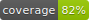

# js-dev-toolkit

[](https://www.gnu.org/licenses/gpl-3.0)
[](coverage/coverage.json)

A collection of zero-dependency vanilla JavaScript utilities for frontend development, focused on data visualization and interactive UI components. Pure vanilla JavaScript, no build step (just include the files you need in your HTML), and very lightweight.

## Modules

| Module                          | Description                                                        |
| - |  |
| [DataTable](#datatable)         | Interactive tables with sorting, filtering, pagination, CSV export |
| [DataFrame](#dataframe)         | Tabular data manipulation with filtering, sorting, I/O             |
| [Sparklines](#sparklines)       | SVG sparkline and sparkbar generation                              |
| [ColorUtil](#colorutil)         | Colormaps and color generation utilities                           |
| [NDArray](#ndarray)             | NumPy format (NPY/NPZ) parsing and array operations                |
| [Notifications](#notifications) | Toast notifications with spinners and progress bars                |
| [Config](#config)               | Configuration management with URL persistence                      |
| [Token Display](#token-display) | LLM token visualization with activation coloring                   |
| [YAML](#yaml)                   | Basic YAML serialization                                           |

## Quick Start

Include the modules you need directly in your HTML, and call the APIs from your js.

```html
<!-- Include the modules you need -->
<script src="src/table.js"></script>
<script src="src/DataFrame.js"></script>
<script src="src/sparklines.js"></script>
<script src="src/ColorUtil.js"></script>
<script src="src/notif.js"></script>
<link rel="stylesheet" href="src/notif.css">
```

## Demos

Open these HTML files in a browser to see the modules in action:

- `index.html` - Comprehensive functionality test
- `demos/grid.html` - DataTable demo
- `demos/sparklines.html` - Sparklines gallery
- `demos/token-display.html` - Token visualization

---

# Module Documentation

## DataTable

Interactive data table ui with sorting, filtering, pagination, and CSV export. Similar API to [ag-grid](https://www.ag-grid.com/).

```javascript
const table = new DataTable('#container', {
  data: [
    { name: 'Alice', age: 25, city: 'NYC' },
    { name: 'Bob', age: 30, city: 'LA' }
  ],
  columns: [
    { key: 'name', label: 'Name', type: 'string' },
    { key: 'age', label: 'Age', type: 'number' },
    { key: 'city', label: 'City', type: 'string' }
  ],
  showFilters: true,
  pageSize: 25
});
```

**Options:**
- `data` - Array of row objects
- `columns` - Column definitions with `key`, `label`, `type`, optional `filterable`, `width`
- `showFilters` - Show filter inputs (default: `true`)
- `pageSize` - Rows per page (default: `10`)
- `pageSizeOptions` - Available page sizes (default: `[10, 25, 50, 100]`)

**Features:**
- Column sorting (click headers)
- Numeric filters (`>50`, `<=100`, `==42`)
- Wildcard text filters (`foo*`, `*bar`)
- Column resizing
- CSV export and clipboard copy
- Nested key support (`stats.entropy`)


## DataFrame

Tabular data structure for manipulation and I/O. Inspired by pandas/polars dataframes from python but extremely simplified for frontend use.

```javascript
const df = new DataFrame([
  { name: 'Alice', age: 25 },
  { name: 'Bob', age: 30 }
]);

// Access data
df.col('age');              // [25, 30]
df.row(0);                  // { name: 'Alice', age: 25 }
df.get(1, 'name');          // 'Bob'
df.col_unique('name');      // Set { 'Alice', 'Bob' }

// Transform
df.col_apply('age', x => x + 1);

// Filter & sort
const filtered = df.filter('age', x => x > 25);
const sorted = df.sort_by('age', true);  // descending
```

**Methods:**
- `col(name)` - Get column values as array
- `row(idx)` - Get row as object
- `get(rowIdx, colName)` - Get cell value
- `col_unique(name)` - Get unique values in column
- `col_apply(name, fn)` - Transform column values
- `filter(colName, predicate)` - Filter rows
- `sort_by(colName, descending)` - Sort by column

**Static I/O methods:**
- `DataFrame.from_json(jsonArray)`
- `DataFrame.from_csv(csvString)`
- `DataFrame.from_jsonl(jsonlString)`
- `df.to_csv()` / `df.to_json()` / `df.to_jsonl()`


## Sparklines

Generate SVG sparklines and bar charts. Meant to be a lightweight plotting util (just creates a csv) for when you need a lot of plots.

```javascript
// Line sparkline
const svg = sparkline([1, 4, 2, 5, 3, 7, 4], {
  width: 200,
  height: 80,
  color: '#4169E1',
  shading: 0.3,      // gradient fill
  markers: 3         // circle markers
});
document.body.appendChild(svg);

// Bar chart
const bars = sparkbars([10, 25, 15, 30, 20], {
  width: 200,
  height: 80,
  color: '#E14169'
});
```

**Options:**
- `width`, `height` - SVG dimensions (default: 160x80)
- `color` - Line/bar color (default: `#4169E1`)
- `lineWidth` - Stroke width for lines (default: 2)
- `shading` - Fill: `false`, `true` (solid), or 0-1 (gradient opacity)
- `markers` - Circle radius for data points, or `null`
- `logScale` - Use logarithmic y-axis
- `xlims`, `ylims` - Custom axis limits `[min, max]`
- `xAxis`, `yAxis` - Axis configuration `{ line, ticks, ... }`


## NDArray

Parse NumPy array files and perform array operations. Originally based on [github.com/aplbrain/npyjs](https://github.com/aplbrain/npyjs) but heavily modified.

```javascript
// Load NPY file
const response = await fetch('data.npy');
const buffer = await response.arrayBuffer();
const arr = parseNPY(buffer);

console.log(arr.shape);   // [100, 50]
console.log(arr.dtype);   // 'float32'

// Array operations
arr.sum();
arr.mean();
arr.min();
arr.max();
arr.get(10, 25);          // value at index
arr.reshape([50, 100]);
arr.transpose();

// Load NPZ (requires JSZip)
const npz = await parseNPZ(arrayBuffer);
const weights = npz['weights.npy'];
```

**Supported dtypes:** uint8, uint16, uint32, uint64, int8, int16, int32, int64, float16, float32, float64, bool


## ColorUtil

Color mapping and generation utilities.

```javascript
// Map values to colormap
const colors = getColorsForValues([10, 20, 30, 40], 'viridis');
// Returns: ['rgb(...)', 'rgb(...)', ...]

// Single value with custom range
const color = getColorForValue(75, [0, 100], 'plasma');

// Generate distinct random colors
const palette = generateDistinctColors(5);

// HSL to hex conversion
const hex = hslToHex(180, 50, 60);  // '#66b3b3'
```

**Colormaps:** `blues`, `reds`, `viridis`, `plasma`


## Notifications

Toast notification system with spinners and progress bars.

```html
<link rel="stylesheet" href="src/notif.css">
<script src="src/notif.js"></script>
```

```javascript
const notif = new NotificationManager();

// Simple notification (auto-dismisses)
notif.show('File saved!', 3000);

// Spinner (manually control)
const spinner = notif.spinner('Loading data...');
// ... do work ...
spinner.complete();  // Shows success
// or
spinner.remove();    // Just remove

// Progress bar
const progress = notif.pbar('Uploading...');
progress.set(0.5);   // 50%
progress.set(1.0);   // 100%, auto-completes
```

**Constructor options:**
- `defaultTimeout` - Auto-dismiss time (default: 4000ms)
- `successTimeout` - Success message time (default: 2000ms)
- `topOffset` - Distance from top (default: 20px)


## Config

Configuration system with URL persistence and multiple override levels.

Priority (lowest to highest):
1. Default configuration
2. Inline config (build-time injection)
3. External `config.json` file
4. URL parameters

```javascript
// Initialize and load config
await initConfig();

// Access config
console.log(CONFIG.theme);
console.log(CONFIG.ui.fontSize);

// Modify (auto-syncs to URL)
CONFIG.theme = 'dark';
updateURLFromConfig();

// Reset to loaded state
resetConfig();

// Export config
exportConfigToNewTab();
copyConfigToClipboard();
```

**Customization:** Search for `TODO[YOUR APP]` comments in `config.js` to customize for your application.


## Token Display

Visualize LLM tokens with color-coded activation values.

```html
<link rel="stylesheet" href="src/token-display.css">
<script src="src/token-display.js"></script>
```

```javascript
const tokens = ['Hello', ',', ' world', '!'];
const activations = [0.8, 0.2, 0.6, 0.4];

const viz = createTokenVisualization(
  tokens,
  activations,
  bertTokenFormatter,  // or gpt2TokenFormatter
  redColorScheme       // or blueColorScheme, greenColorScheme
);

document.body.appendChild(viz);
```

**Tokenizer formatters:**
- `bertTokenFormatter` - Handles `##subword` tokens
- `gpt2TokenFormatter` - Handles GPT-2 style tokens

**Color schemes:**
- `redColorScheme`, `blueColorScheme`, `greenColorScheme`
- `createColorScheme([r, g, b])` - Custom RGB color


## YAML

Simple YAML serialization for objects. Only serialization, parsing is much more complex and not implemented.

```javascript
const obj = {
  name: 'config',
  settings: {
    enabled: true,
    count: 42
  },
  items: ['a', 'b', 'c']
};

const yaml = toYAML(obj);
// name: "config"
// settings:
//   enabled: true
//   count: 42
// items: ["a", "b", "c"]
```


---


# Development

## Running Tests

Tests use Python with Playwright for browser automation:

```bash
# Install Playwright browsers (first time)
make install-playwright

# Run tests
make test

# Run with verbose output
make test-verbose
```

## Code Formatting

```bash
# Format all code
make format

# Check formatting
make format-check
```

## Project Structure

```
js-dev-toolkit/
├── src/                  # Source modules
│   ├── table.js         # DataTable component
│   ├── DataFrame.js     # DataFrame class
│   ├── sparklines.js    # Sparkline generation
│   ├── ColorUtil.js     # Color utilities
│   ├── array.js         # NumPy parsing
│   ├── notif.js         # Notifications
│   ├── notif.css
│   ├── config.js        # Configuration management
│   ├── token-display.js # Token visualization
│   ├── token-display.css
│   └── yaml.js          # YAML serialization
├── demos/               # Demo HTML files
├── tests/               # Browser-based tests
├── index.html           # Main demo page
└── Makefile            # Build recipes
```


## Browser Compatibility

Requires modern browsers with support for:
- ES6+ (classes, arrow functions, template literals)
- `fetch()` API
- `Blob` and `URL.createObjectURL()`
- TypedArrays (Float32Array, etc.)


## License

[GNU General Public License v3.0](LICENSE)
